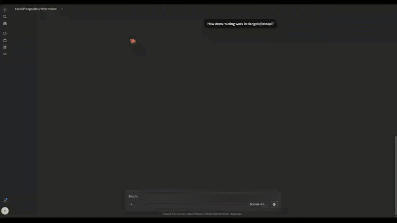
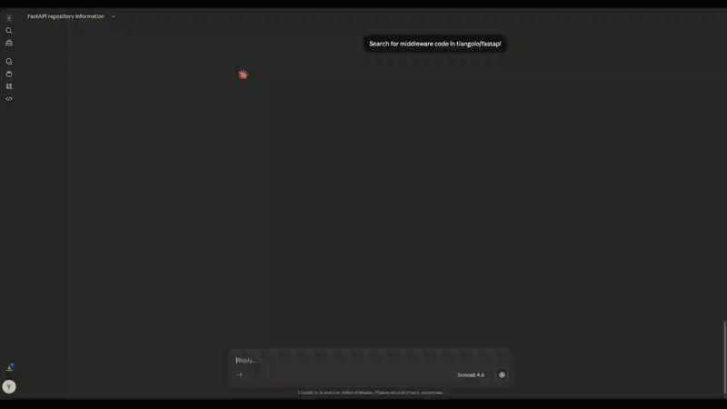
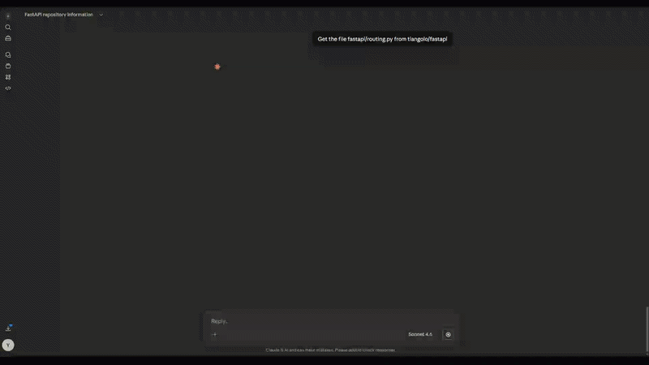
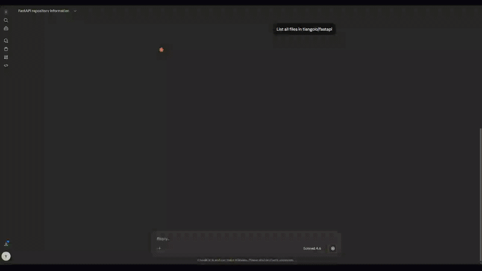
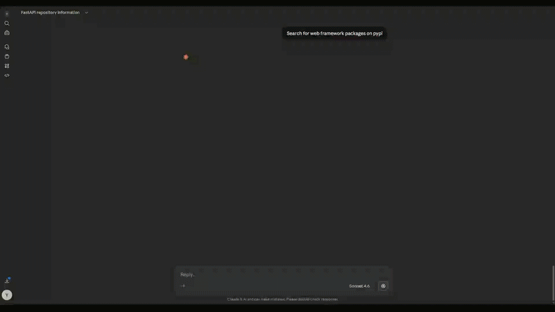
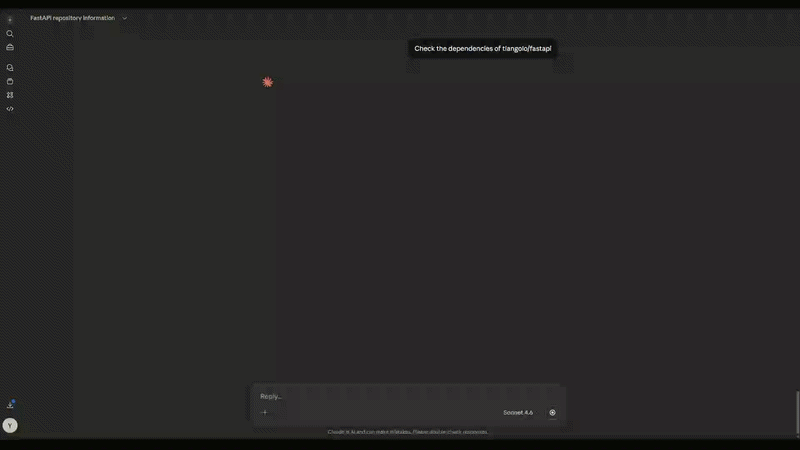
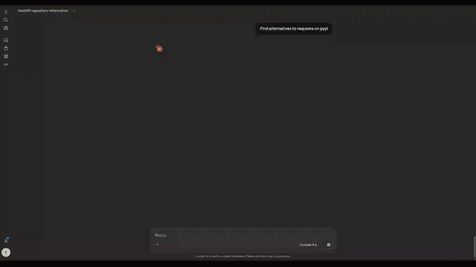
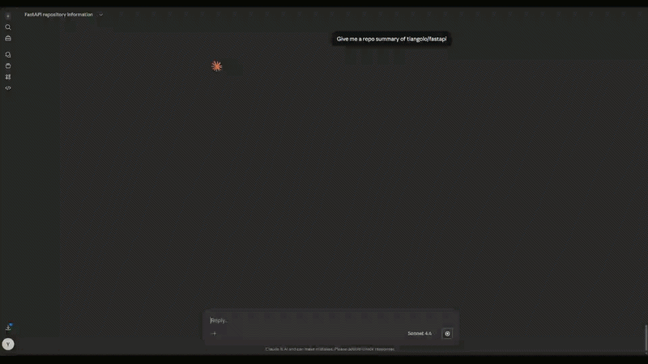
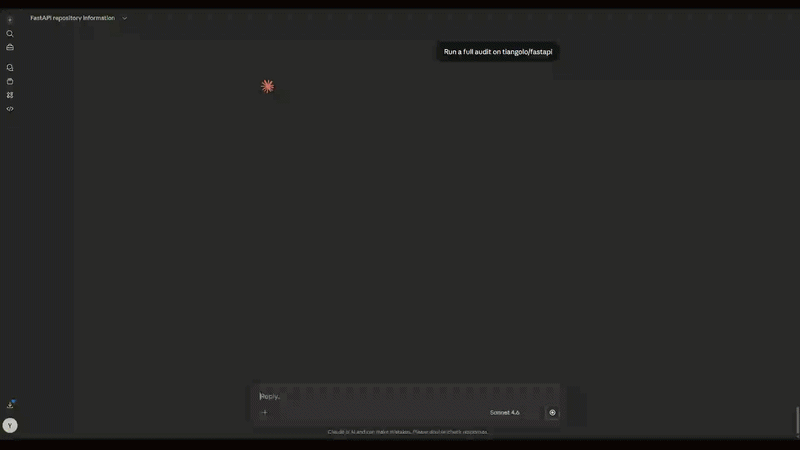
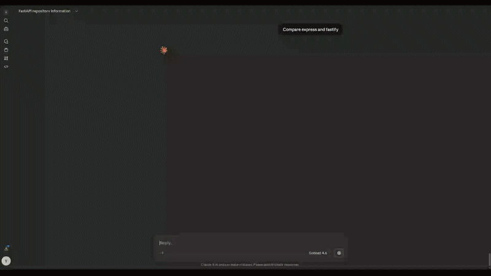

# CodeLens MCP

An MCP server that gives Claude Desktop complete intelligence about any public GitHub repository. Research libraries, compare packages, audit dependencies, and explore codebases through natural conversation.

---

## What it does

Most developers waste time switching between GitHub, npm, PyPI, and documentation tabs just to evaluate a library. CodeLens brings all of that into a single Claude Desktop conversation.

Ask things like:

- *"Is moment.js still worth using?"*
- *"Compare express and fastify for a new node project"*
- *"How does authentication work in tiangolo/fastapi?"*
- *"Are any dependencies in this repo unmaintained?"*
- *"What's a good alternative to axios?"*
- *"Give me a full audit of pallets/flask"*

Every answer is pulled live from GitHub and Libraries.io.

---

## Requirements

- Python 3.11+
- Claude Desktop
- GitHub Personal Access Token (free)
- Libraries.io API Key (free)

---

## Installation

### 1. Clone the repo

```bash
git clone https://github.com/Yashkashte5/Codelens-MCP
cd Codelens-MCP
```

### 2. Install dependencies

```bash
pip install -r requirements.txt
```

### 3. Get your API keys

**GitHub Token**
1. Go to github.com → Settings → Developer settings → Personal access tokens → Tokens (classic)
2. Generate new token, give it a name, check `repo` and `read:org`
3. Copy the token

**Libraries.io Key**
1. Go to [libraries.io/account](https://libraries.io/account)
2. Sign up and copy your API key

### 4. Configure Claude Desktop

Edit your Claude Desktop config file:

- **macOS:** `~/Library/Application Support/Claude/claude_desktop_config.json`
- **Windows:** `%APPDATA%\Claude\claude_desktop_config.json`

```json
{
  "mcpServers": {
    "codelens-mcp": {
      "command": "python",
      "args": ["C:\\path\\to\\Codelens-MCP\\server.py"],
      "env": {
        "GITHUB_TOKEN": "your_github_token_here",
        "LIBRARIES_IO_API_KEY": "your_libraries_io_key_here",
        "PYTHONPATH": "C:\\path\\to\\Codelens-MCP"
      }
    }
  }
}
```

Restart Claude Desktop. CodeLens will appear in your connectors.

---

## File Structure

```
Codelens-MCP/
├── server.py        — MCP entry point, all tools registered
├── github.py        — GitHub API client
├── tools/
│   ├── codebase.py  — repo exploration tools
│   ├── packages.py  — Libraries.io package tools
│   └── combined.py  — audit, summary, and compare tools
├── demo/            — demo GIFs for all tools
├── requirements.txt
└── .env
```

---

## Tools

### tool_ask_repo
Answer natural language questions about any GitHub repo. Searches and fetches relevant code on the fly with exact file citations.



---

### tool_search_code
Search for specific code patterns inside a repo. Optionally filter by language.



---

### tool_get_file
Fetch the full contents of any file from any public GitHub repo.



---

### tool_list_files
List all files in a GitHub repository, with optional extension filtering.



---

### tool_search_packages
Search Libraries.io for packages across any platform — npm, pypi, cargo, and more.



---

### tool_get_package_info
Get detailed info about a specific package — version, stars, contributors, maintenance status.


---

### tool_check_dependencies
Fetch package files directly from a GitHub repo and audit every dependency for health and maintenance status.



---

### tool_find_alternatives
Find alternative packages to replace a given dependency, ranked by stars and maintenance.



---

### tool_repo_summary
High-level summary of any GitHub repo — purpose, structure, technologies, and dependency health in one shot.



---

### tool_audit_repo
Full repo audit combining code overview and dependency health report in a single call.



---

### tool_compare
Compare two GitHub repos or packages side by side. Auto-detects whether inputs are repos or packages and hits the right API accordingly.



---

## Tech Stack

| Layer | Tool |
|-------|------|
| Interface | Claude Desktop |
| MCP SDK | `mcp` Python SDK |
| Code search | GitHub Code Search API |
| Package data | Libraries.io API |
| Language | Python 3.11+ |

---

## Limits

- GitHub API: 5,000 requests/hour with a token
- Libraries.io free tier: 60 requests/minute
- Works on public GitHub repos only

---

## License

MIT
